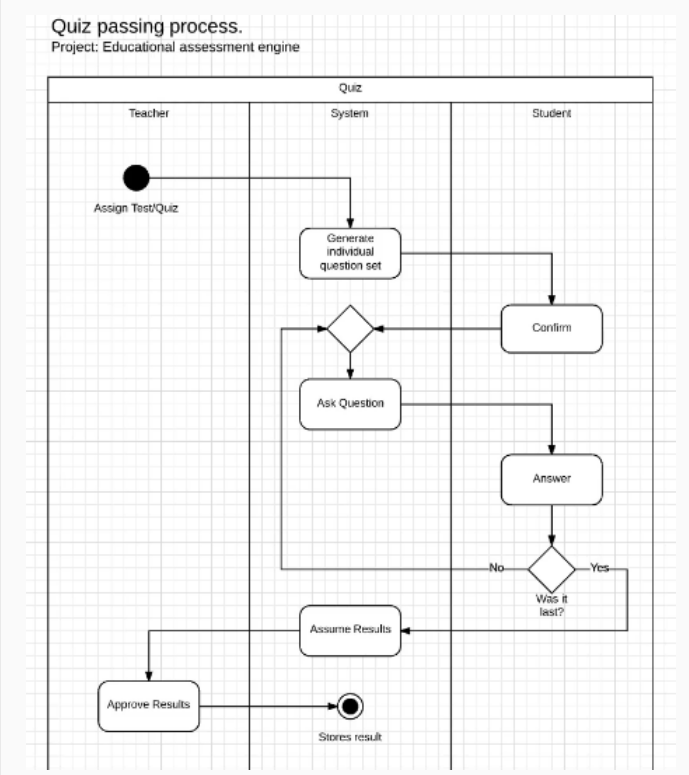

Diagrama de Actividad
Modelar el proceso de realización de un cuestionario (quiz) dentro de un sistema de evaluación educativa.

Requisitos:

- Entre 6 y 10 actividades.
- Roles:
    - Profesor (Teacher)
    - Sistema (System)
    - Estudiante (Student)

Ejemplos de actividades:

- Hacer una pregunta.
- Generar un conjunto de preguntas.
- Aprobar resultados.

El diagrama debe utilizar swim lanes para separar las actividades de cada participante. Cada actividad debe ubicarse dentro del rol correspondiente, por ejemplo, la generación de preguntas debe pertenecer al sistema.

---

Este diagrama de actividad representa el flujo del proceso de realización de un examen dentro de un sistema de evaluación educativa. El modelo utiliza swim lanes para separar las acciones del profesor, el sistema y el estudiante. El proceso inicia cuando el profesor asigna el cuestionario y el sistema genera las preguntas. Posteriormente, el estudiante confirma el inicio del examen y responde cada pregunta mientras el sistema controla el flujo y verifica si existen más preguntas pendientes. Una vez finalizado el cuestionario, el sistema calcula los resultados, los envía al profesor para su aprobación y finalmente almacena las calificaciones. El diagrama permite visualizar de forma clara las responsabilidades y la interacción entre los distintos participantes del sistema.