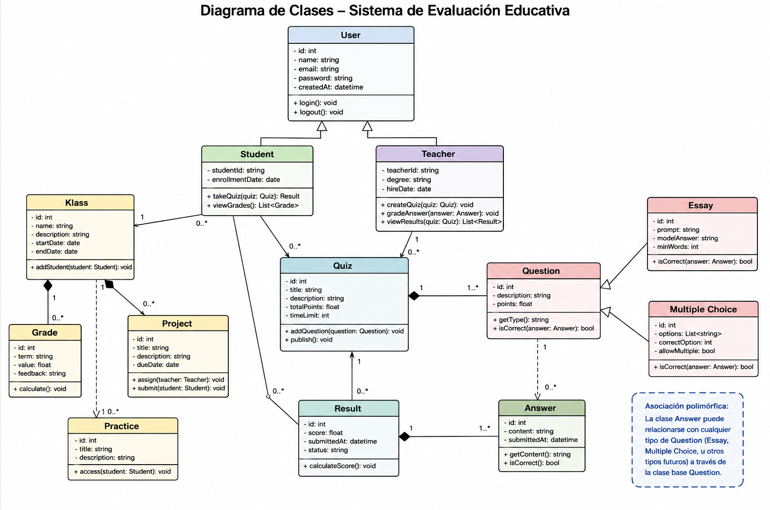

Diagrama de Clases
Diseñar el diagrama de clases del sistema de evaluación educativa.

Clases requeridas:

- Student
- Klass
- Grade
- Result
- Teacher
- User
- Quiz
- Question
- Essay
- Multiple Choice
- Answer
- Project
- Practice

Notas:

- “Klass” se utiliza en lugar de “Class” porque en muchos lenguajes de programación “Class” es una palabra reservada.
- Las clases deben estar correctamente organizadas mediante herencia, por ejemplo:
    - Teacher y Student heredan de User.  
- El sistema debe permitir asociaciones polimórficas para que una misma clase Answer pueda relacionarse con distintos tipos de preguntas.



Una asociación es una relación entre clases.

Ejemplo:
```
Quiz -------- Result
```
Significa:

un Quiz está relacionado con Result

La multiplicidad indica cantidades.

Ejemplo:
```
Quiz 1 -------- * Result
```
Significa:

un quiz puede tener muchos resultados

El símbolo * significa “muchos”.

Otros ejemplos:
```
1      exactamente uno
0..1   opcional
*      muchos
1..*   uno o muchos
```

La composición representa una relación fuerte entre objetos.

Ejemplo:
```
House ◆------ Room
```
La casa está compuesta de habitaciones.

Pero la clave es esta:

    la habitación no tiene sentido sin la casa.

Si destruyes la casa, las habitaciones desaparecen.

Eso es composición.

Diferencia entre asociación y composición
Asociación
```
Teacher -------- Student
```
Un profesor puede existir sin un estudiante.

La relación es flexible.

Composición
```
Car ◆------ Engine
```
El motor forma parte esencial del coche.  
La existencia del motor depende del coche.  
La relación es fuerte.  

El triángulo blanco apunta hacia la clase más general.

Student es específico.
User es general.
```
Student ------▷ User
Teacher ------▷ User
```
Student y Teacher son tipos de User.