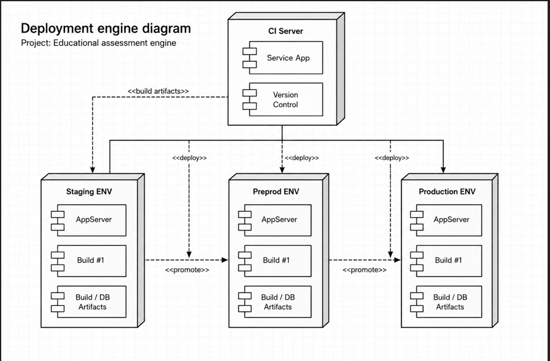

Diagrama de Despliegue
Diseñar el diagrama de despliegue del sistema utilizando un servicio de integración continua (CI).

Nodos requeridos:

- Continuous Integration (CI) server
- Staging environment
- Pre-production environment
- Production environment

El diagrama debe representar cómo el código pasa por procesos de pruebas, validaciones y despliegue antes de llegar al entorno de producción.

El diagrama de despliegue representa la arquitectura utilizada para publicar y mantener una aplicación de evaluaciones educativas dentro de distintos entornos de trabajo. Su objetivo principal es mostrar cómo fluye el sistema desde el desarrollo del código hasta su publicación final en producción, utilizando procesos automatizados de validación y despliegue.

El proceso inicia cuando los desarrolladores realizan cambios en el sistema y los almacenan en un repositorio de control de versiones. Este repositorio permite centralizar el código fuente y mantener un historial de modificaciones realizadas por cada integrante del equipo. En lugar de enviar los cambios directamente al servidor principal, el sistema utiliza un servidor de integración continua (CI Server) para validar automáticamente cada actualización.

El servidor de integración continua cumple una función crítica dentro de la arquitectura porque automatiza tareas técnicas esenciales antes del despliegue. Entre estas tareas se encuentran la ejecución de pruebas automáticas, validaciones de dependencias, migraciones de base de datos y construcción completa de la aplicación. Gracias a este proceso, el sistema puede detectar errores antes de que afecten a los usuarios finales.

Cuando todas las pruebas son superadas correctamente, el servidor CI genera una versión funcional de la aplicación y la despliega automáticamente al entorno de staging. El entorno de staging funciona como una réplica controlada del sistema real y permite verificar que la aplicación continúe operando correctamente después de cada actualización. Aquí se realizan pruebas funcionales y revisiones visuales para comprobar que no existan fallos que las pruebas automáticas no hayan detectado.

En aplicaciones de gran escala también puede existir un entorno de preproducción. Este entorno se encuentra entre staging y producción y normalmente es utilizado por equipos de QA (Quality Assurance). Su función es ejecutar pruebas más exhaustivas relacionadas con rendimiento, estabilidad, experiencia del usuario y validación completa de funcionalidades antes de liberar el sistema oficialmente.

Finalmente, después de superar todas las validaciones técnicas y funcionales, la aplicación es desplegada en producción. El entorno de producción representa la versión final accesible para los usuarios reales del sistema educativo. Todo este flujo automatizado permite reducir errores humanos, mejorar la estabilidad del software y garantizar que únicamente versiones verificadas lleguen al entorno final.

El propósito del diagrama es mostrar cómo interactúan los diferentes nodos y entornos dentro de una arquitectura moderna de despliegue, destacando la importancia de la automatización, la integración continua y las múltiples capas de validación dentro del ciclo de desarrollo de software.