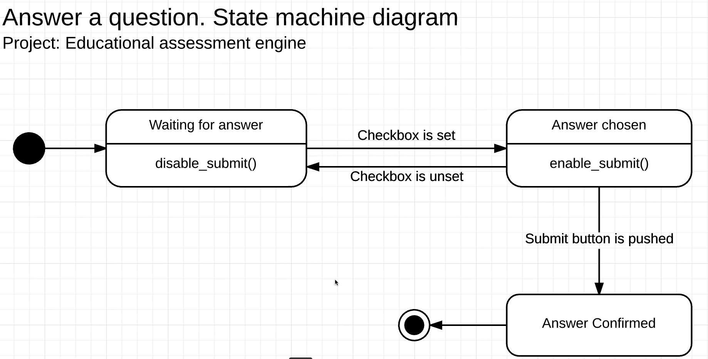

Diagrama de Máquina de Estados
Modelar el flujo de estados del proceso de respuesta de preguntas.

Estados requeridos:

- Waiting for answer
- Answer chosen
- Answer confirmed
- Submit status

El diagrama debe representar cómo cambia el estado de una respuesta desde que el estudiante espera responder hasta que finalmente envía la respuesta.

La idea principal no es solamente mostrar estados, sino enseñar cómo un usuario puede cambiar entre ellos dependiendo de sus acciones.

Este diagrama de máquina de estados representa el comportamiento del sistema mientras un estudiante responde una pregunta en una plataforma educativa. El flujo comienza en el estado inicial, donde el botón de envío permanece deshabilitado porque todavía no existe una respuesta seleccionada. Este estado sirve como mecanismo de validación para evitar que el usuario envíe respuestas vacías.

Cuando el estudiante selecciona una opción o comienza a escribir una respuesta, ocurre una transición de estado. El sistema detecta la acción del usuario y cambia al estado donde el botón “Submit” queda habilitado. Esto demuestra cómo las acciones del usuario generan cambios dentro de la aplicación.

El diagrama también muestra una relación bidireccional entre estados. Si el usuario desmarca la respuesta o elimina el contenido escrito, el sistema regresa automáticamente al estado anterior y vuelve a deshabilitar el botón de envío. Este comportamiento es importante porque representa validaciones dinámicas y demuestra que un usuario puede avanzar y retroceder entre estados dependiendo de sus decisiones.

Finalmente, cuando el estudiante presiona el botón de enviar, el sistema cambia al estado final de “respuesta confirmada”. En este punto el proceso termina porque la respuesta ya fue registrada correctamente. El objetivo principal de este diagrama es modelar cómo cambia el comportamiento del sistema según las acciones del usuario y cómo cada transición depende de eventos específicos.