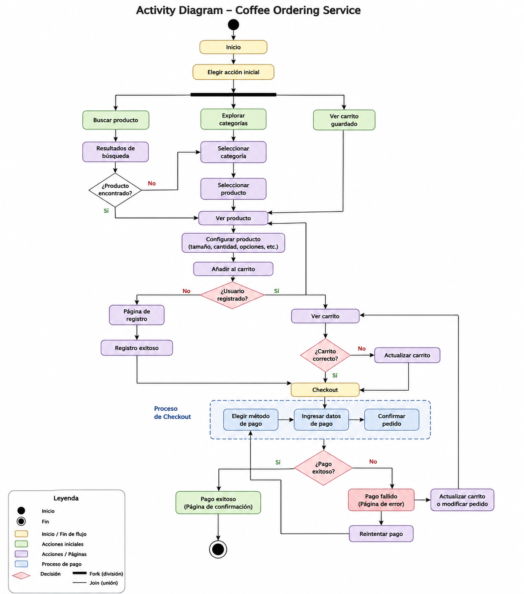

Modelar mediante un diagrama de actividad (UML Activity Diagram) el flujo completo de un sistema de compra en una tienda online de café.

El sistema debe representar el recorrido del usuario desde la búsqueda del producto hasta la finalización del pago, incluyendo decisiones alternativas como:

- búsqueda de productos
- navegación por categorías
- selección de productos
- configuración del pedido (tamaño, cantidad, etc.)
- gestión del carrito
- registro de usuario si no está autenticado
- proceso de checkout
- validación de pago
- manejo de errores de pago

El objetivo es reflejar tanto el flujo correcto como los posibles caminos alternativos o fallidos del proceso.

Actor principal que interactúa con el sistema para buscar, seleccionar y comprar productos.

🔄 Inicio del flujo

El proceso comienza cuando el usuario entra al sistema y decide una acción inicial:

- buscar producto
- explorar categorías
- ver carrito guardado

🛒 Selección de producto

El usuario accede a un producto desde:

- búsqueda directa
- categorías
- carrito

Luego puede:

- configurar opciones del producto (cantidad, tamaño, etc.)
- añadir el producto al carrito

🔀 Decisión: usuario registrado

El sistema verifica si el usuario está registrado:

- ✔ Sí → continúa al carrito / checkout
- ❌ No → redirige a registro y luego al carrito
- 🧺 Carrito de compra

El usuario revisa su carrito:

- confirmar pedido
- modificar productos
- actualizar cantidades

Después de la revisión pasa al checkout.

💳 Checkout (pago)

El usuario realiza el proceso de pago:

- selección de método de pago
- introducción de datos
- confirmación del pedido

⚠️ Resultado del pago (decisión)
- ✔ Pago exitoso → página de confirmación
- ❌ Pago fallido → página de error

En caso de fallo, el usuario puede:

- reintentar pago
- modificar carrito
- volver al proceso de checkout

🎯 Estado final

El flujo termina cuando:

el pago es exitoso y el pedido se confirma