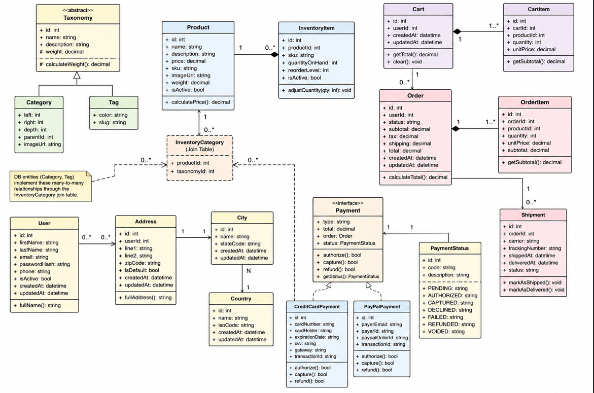

Ecommerce Sistema de pedidos de café (Class Diagram)
Objetivo

Diseñar el diagrama de clases de un sistema de eCommerce para una tienda de café online. El sistema debe permitir gestionar productos, taxonomías (categorías y etiquetas), usuarios, direcciones y pagos, aplicando principios de diseño orientado a objetos y normalización de bases de datos.

Requisitos del sistema
1. Productos e inventario
    El sistema debe manejar productos de café.
    Cada producto puede pertenecer a múltiples categorías y tener múltiples etiquetas.
    Las relaciones entre productos y taxonomías deben ser de tipo many-to-many, usando tablas intermedias.
2. Taxonomía  
    Debe existir una clase abstracta llamada Taxonomy.  
    Taxonomy contiene atributos comunes como:  
    - id  
    - nombre  
    - descripción    

   De esta clase heredan:
    - Category
    - Tag
    
    Ambas clases pueden añadir atributos específicos.
3. Usuarios y direcciones  
    Un usuario puede tener múltiples direcciones.  
    Una dirección puede pertenecer a múltiples usuarios.  
    Cada dirección debe estar normalizada y separada en:  
        - City
        - Country  

    Se debe evitar almacenar información de ubicación como texto libre en el usuario.  
4. Sistema de pagos  
    Debe existir una interfaz Payment.  
    Esta interfaz define el comportamiento general del pago:  
        - tipo de pago  
        - total  
        - orden asociada  
        - estado del pago  
    Las implementaciones concretas son:  
        - CreditCardPayment  
        - PayPalPayment  
    Cada método de pago gestiona su propia lógica de procesamiento.
5. Estado del pago  
    El sistema debe incluir una clase PaymentStatus.  
    Esta clase controla estados como:  
    - pendiente  
    - aprobado  
    - rechazado  
    
    Debe garantizar la integridad del flujo de pago.

El diseño se basa en principios de orientación a objetos, abstracción y normalización de bases de datos.

La clase Taxonomy actúa como una abstracción general que evita duplicación de atributos comunes entre categorías y etiquetas. Este enfoque permite extensibilidad sin modificar la estructura base del sistema.

La relación entre Product, Category y Tag es de tipo muchos-a-muchos, lo que refleja un modelo flexible típico de sistemas eCommerce. Esto evita rigidez en la clasificación de productos y permite múltiples formas de filtrado.

En el módulo de usuarios, el sistema aplica normalización de datos separando City y Country en entidades independientes. Esto reduce redundancia, mejora consistencia y permite validación estructurada de datos geográficos.

El subsistema de pagos se diseña mediante una interfaz Payment, lo que permite desacoplar la lógica de procesamiento de pagos. CreditCardPayment y PayPalPayment implementan esta interfaz de forma independiente, evitando sistemas altamente acoplados y facilitando la escalabilidad del sistema.

Finalmente, PaymentStatus centraliza el control del estado de las transacciones, asegurando consistencia en flujos críticos como aprobación, rechazo o espera de pagos. Esto reduce errores en procesos financieros y mejora la trazabilidad del sistema.

En conjunto, el diseño prioriza modularidad, reutilización y bajo acoplamiento, lo cual es esencial en arquitecturas de eCommerce escalables.