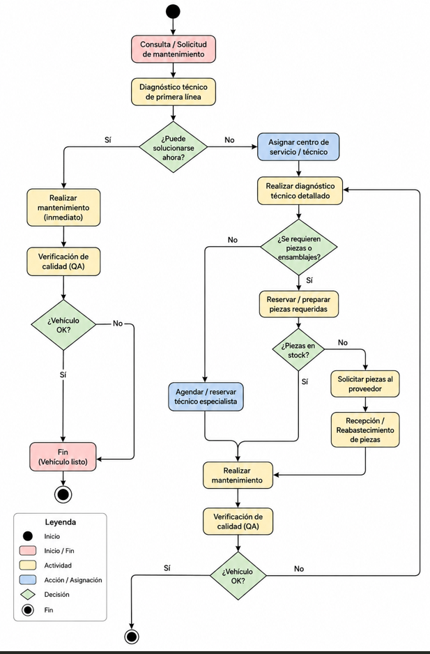

Una empresa de gestión de flotas necesita modelar el proceso de mantenimiento de sus vehículos mediante un Activity Diagram de UML.

El objetivo del sistema es permitir que los conductores reporten incidencias o solicitudes de mantenimiento y que el sistema gestione automáticamente todas las etapas necesarias hasta que el vehículo quede operativo nuevamente.

El flujo debe comenzar cuando un usuario realiza una consulta o solicitud de mantenimiento. A partir de ahí, el sistema debe realizar un primer diagnóstico técnico para determinar si el problema puede resolverse inmediatamente o si requiere un proceso más complejo.

Si la avería es sencilla, el vehículo pasa directamente al mantenimiento y posteriormente a una verificación de calidad. Si todo funciona correctamente, el proceso finaliza.

En caso de que el problema no pueda resolverse rápidamente, el sistema deberá asignar un centro de servicio o técnico responsable, realizar un diagnóstico técnico detallado y verificar si son necesarias piezas o ensamblajes nuevos.

Si se requieren piezas:

- el sistema comprobará si están en stock,
- si no están disponibles, deberá solicitarlas al proveedor,
- y una vez recibidas podrá continuar el mantenimiento.

Finalmente, tras realizar la reparación o mantenimiento, el sistema comprobará si el vehículo funciona correctamente.
Si el vehículo sigue presentando problemas, el flujo volverá al diagnóstico técnico detallado para repetir el proceso hasta resolver completamente la incidencia.

--- 

Este Activity Diagram representa el flujo completo del proceso de mantenimiento dentro de un sistema de gestión de flotas.

El proceso comienza cuando un conductor o usuario genera una solicitud de mantenimiento. A continuación, el sistema realiza un primer diagnóstico técnico para identificar rápidamente el tipo de problema.

Desde este punto aparecen las primeras decisiones del flujo:

si la avería puede solucionarse inmediatamente, el vehículo pasa directamente a mantenimiento y luego a una validación de calidad;
si no puede resolverse rápidamente, el sistema inicia un proceso más avanzado.

En el flujo avanzado se asigna un centro de servicio o un técnico especializado y se realiza un diagnóstico técnico detallado. Este diagnóstico permite determinar si se necesitan piezas nuevas para completar la reparación.

Cuando las piezas son necesarias, el sistema comprueba si están disponibles en inventario:

- si hay stock, se continúa con la reparación;
- si no hay stock, las piezas deben solicitarse al proveedor antes de continuar.

Una vez disponibles los recursos necesarios, se agenda al especialista técnico y se realiza el mantenimiento correspondiente.

El proceso termina con una comprobación final del estado del vehículo. Si el vehículo funciona correctamente, el flujo finaliza. En cambio, si el problema persiste, el sistema regresa al diagnóstico técnico detallado para repetir el ciclo de revisión y reparación.

Este tipo de diagrama es especialmente útil porque no solo muestra el “camino ideal”, sino también todos los escenarios alternativos, decisiones y bucles que pueden ocurrir en un sistema real.