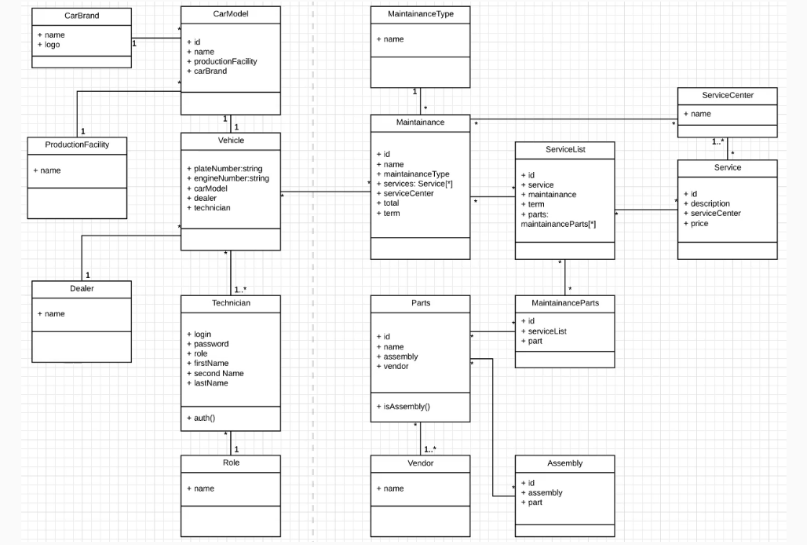

Se debe diseñar un diagrama de clases UML para un sistema empresarial de gestión de flotas (fleet management system) con arquitectura tipo CRUD. El sistema debe permitir gestionar vehículos, mantenimiento, piezas y servicios asociados, estructurando los datos en entidades bien normalizadas.

El objetivo principal no es solo representar entidades, sino modelar correctamente las relaciones entre tablas/clases para garantizar escalabilidad, mantenibilidad y separación de responsabilidades.

En particular, se debe:

Definir las entidades principales del dominio (por ejemplo: Vehicle, CarModel, Maintenance, Parts, ServiceList, etc.).
Separar correctamente los conceptos en clases más pequeñas en lugar de agrupar demasiada lógica o datos en una sola entidad.
Modelar relaciones entre clases (uno a uno, uno a muchos, muchos a muchos según corresponda).
Evitar acoplamientos innecesarios entre entidades que puedan limitar la escalabilidad futura.
Representar una arquitectura orientada a base de datos (ORM-style), típica de sistemas empresariales CRUD.

El diagrama representa un sistema de gestión de flotas centrado en la administración de vehículos y sus procesos de mantenimiento.

La idea central es que el sistema no está orientado a lógica compleja de negocio, sino a la gestión estructurada de datos, donde cada clase representa una tabla en base de datos y sus relaciones.

Vehículo como entidad central

La clase Vehicle actúa como núcleo del sistema. Representa cada vehículo dentro de la flota. A partir de esta entidad se conectan otras como el modelo del coche (CarModel) o los registros de mantenimiento.

Una relación importante aquí es la relación uno a uno entre Vehicle y CarModel. Esto significa que cada vehículo está asociado directamente a un único modelo. Este tipo de relación se usa para facilitar la navegación directa entre objetos y simplificar consultas.

Separación de piezas (Parts vs MaintenanceParts)

Existe una separación intencional entre Parts y MaintenanceParts.

Parts representa el catálogo general de piezas disponibles en el sistema (inventario global).

MaintenanceParts representa las piezas utilizadas específicamente en procesos de mantenimiento.

Aunque podrían unificarse o incluso modelarse mediante herencia, se separan deliberadamente para evitar acoplamientos y permitir escalabilidad. Por ejemplo, si en el futuro se usan piezas en otros contextos (no solo mantenimiento), no sería necesario rediseñar el sistema.

Mantenimiento y servicios

El sistema incluye entidades relacionadas con el mantenimiento de vehículos. Aquí aparece ServiceList o entidades similares que agrupan los servicios realizados.

Estas clases suelen tener relaciones uno a muchos con registros de mantenimiento, ya que un vehículo puede tener múltiples intervenciones a lo largo del tiempo.

Enfoque en normalización y escalabilidad

Uno de los principios clave del diagrama es la normalización de datos: en lugar de crear clases grandes y monolíticas, se fragmenta el dominio en entidades más pequeñas y específicas.

Esto permite:

Reducir redundancia de datos
Facilitar mantenimiento del sistema
Escalar funcionalidades sin refactorizar estructuras existentes
Uso de relaciones uno a uno

El diagrama incluye relaciones uno a uno, que no son las más comunes pero sí muy útiles en diseño empresarial. Se usan principalmente para mejorar la navegabilidad entre objetos.

Ejemplo típico: Vehicle → CarModel

Esto permite acceder directamente a información del modelo desde el vehículo sin necesidad de joins complejos o estructuras intermedias.

Conclusión

El diagrama no busca complejidad, sino diseño estructural correcto. Es un sistema CRUD bien normalizado donde la clave no está en la lógica, sino en cómo se separan las entidades y se definen las relaciones para permitir crecimiento futuro sin reescrituras importantes.