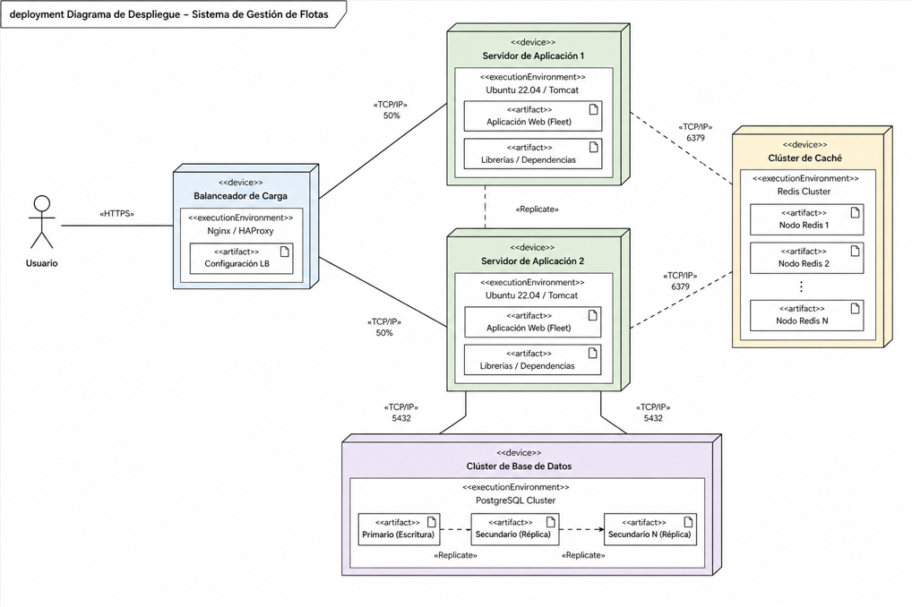

Se requiere diseñar el diagrama de despliegue (Deployment Diagram) de un sistema empresarial de gestión de flotas (Fleet Management System). El objetivo es representar la arquitectura física del sistema en producción, mostrando cómo se distribuyen los componentes principales y cómo se gestionan las solicitudes de los usuarios a través de la infraestructura.

El sistema debe incluir, como mínimo, los siguientes elementos: un balanceador de carga, múltiples servidores de aplicación, un clúster de caché y un clúster de base de datos. El diseño debe reflejar cómo las solicitudes entrantes son distribuidas entre servidores, cómo se optimiza el rendimiento mediante caching y cómo se garantiza la persistencia y consistencia de los datos en la base de datos.

Además, se debe contemplar un escenario de alta disponibilidad, donde la caída de un servidor no interrumpa el servicio, y el sistema pueda seguir respondiendo a las peticiones mediante los recursos restantes.

---

Este diagrama representa la arquitectura de despliegue de un sistema de gestión de flotas en un entorno empresarial.

En la parte superior se encuentra el balanceador de carga, cuya función es distribuir las solicitudes entrantes de los usuarios de manera equilibrada entre los servidores de aplicación. En este caso, se asume una distribución simple del 50% del tráfico a cada servidor, lo que permite evitar la sobrecarga de un único nodo y proporciona tolerancia a fallos en caso de caída de uno de los servidores.

Debajo del balanceador se encuentran los servidores de aplicación, que son responsables de procesar la lógica del sistema y responder a las peticiones de los usuarios. Estos servidores están diseñados para ser redundantes, es decir, pueden ejecutar la misma funcionalidad de forma independiente.

El sistema incorpora un clúster de caché, utilizado para almacenar datos y recursos que no cambian con frecuencia, como archivos estáticos o respuestas reutilizables. Esto reduce la carga sobre los servidores de aplicación y mejora el rendimiento general del sistema. La caché puede ser invalidada o actualizada cuando se realizan cambios en el sistema.

Finalmente, se encuentra el clúster de base de datos, que almacena la información crítica y dinámica del sistema, como solicitudes de mantenimiento, estados de vehículos o datos de usuarios. A diferencia de la caché, estos datos no deben ser almacenados de forma persistente en sistemas intermedios, ya que requieren consistencia y actualización inmediata.

En conjunto, esta arquitectura garantiza escalabilidad, rendimiento y alta disponibilidad, separando claramente la lógica de procesamiento, el almacenamiento temporal y la persistencia de datos.