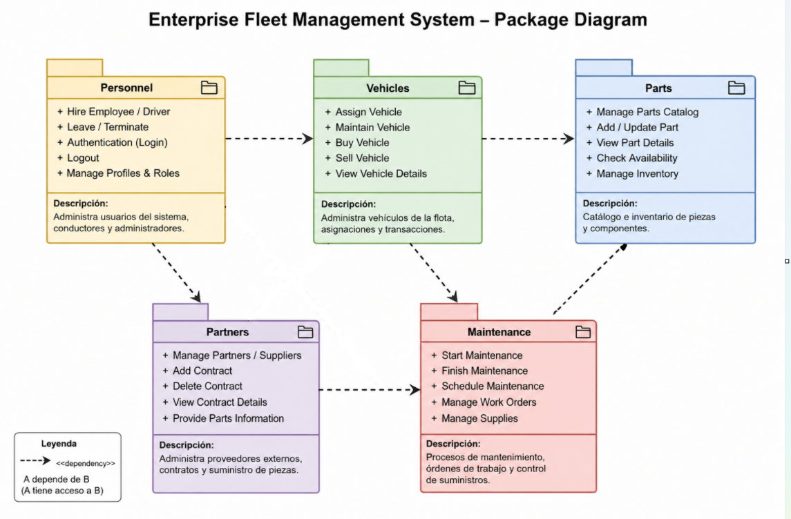

Diseñar un Package Diagram UML para un sistema empresarial de gestión de flotas.

El sistema debe permitir administrar conductores, vehículos, mantenimiento, inventario de piezas y proveedores externos.

El diagrama debe:

- dividir el sistema en módulos organizados,
- representar las dependencias entre paquetes,
- mostrar qué módulos tienen acceso a otros,
- reflejar la estructura general de la arquitectura del sistema.

Los paquetes principales del sistema son: 

1.Personnel

- administración de usuarios,
- autenticación,
- contratación de conductores,
- gestión de empleados.    

2.Vehicles  
- compra y venta de vehículos,  
- asignación de vehículos,  
- mantenimiento de unidades.

3. Parts
- catálogo de piezas,
- almacenamiento de inventario,
- disponibilidad de componentes.

4. Maintenance
- procesos de reparación,
- flujo de mantenimiento,
- control de órdenes y suministros.
5. Partners
- proveedores externos,
- contratos,
- suministro de piezas.

El diagrama debe incluir las relaciones de dependencia entre paquetes y justificar por qué ciertos módulos necesitan acceso a otros.

El Package Diagram representa la organización de alto nivel del sistema de gestión de flotas. Cada paquete encapsula responsabilidades específicas y mantiene separadas las distintas áreas funcionales de la aplicación.

Paquete Personnel

El módulo Personnel administra usuarios, conductores y administradores del sistema. Entre sus funciones están:

- login,
- logout,
- autenticación,
- contratación de empleados.

Este paquete tiene dependencia hacia:

- Vehicles
- Partners

La razón es que los usuarios del sistema necesitan interactuar con los vehículos y con los proveedores. Por ejemplo:

- un administrador puede asignar vehículos,
- un usuario puede crear o eliminar contratos con proveedores.

La dependencia indica que Personnel puede acceder a funcionalidades de esos módulos, pero no necesariamente al contrario.

Paquete Vehicles

El módulo Vehicles administra toda la lógica relacionada con los vehículos:

- asignación,
- compra,
- venta,
- mantenimiento.

Vehicles depende de:

- Parts
- Maintenance

Esto ocurre porque los vehículos necesitan consultar piezas disponibles para reparaciones y también interactuar con el sistema de mantenimiento.

Por ejemplo:

- verificar si una pieza está disponible,
- iniciar una orden de reparación,
- registrar mantenimiento preventivo.

Paquete Parts

El módulo Parts funciona como catálogo e inventario de piezas.

Aquí se almacenan:

- neumáticos,
- motores,
- frenos,
- componentes mecánicos.

Este paquete suele representar entidades bastante directas en base de datos.

Su responsabilidad principal es proveer información sobre disponibilidad y stock.

Paquete Maintenance

Maintenance representa uno de los módulos más complejos del sistema.

No es solamente una tabla de base de datos. Es prácticamente una mini aplicación interna con:

- workflows,
- órdenes de reparación,
- procesos de mantenimiento,
- validaciones,
- seguimiento de estados.

Este módulo controla el flujo completo del mantenimiento de vehículos.

Por eso tiene mucha interacción con:

- Vehicles
- Parts
- Partners

Paquete Partners

Partners administra los proveedores y contratos externos.

Sus funciones incluyen:

- registrar proveedores,
- gestionar contratos,
- consultar disponibilidad de piezas,
- coordinar suministros.

Este módulo necesita comunicarse con Maintenance porque durante una reparación el sistema debe consultar si un proveedor tiene ciertas piezas disponibles.

Importancia de las dependencias

Las dependencias son uno de los puntos más importantes del package diagram.

Una dependencia significa:

- acceso entre módulos,
- comunicación entre paquetes,
- relación funcional,
- impacto arquitectónico.

Por ejemplo:

Personnel → Partners

significa que Personnel puede utilizar funcionalidades de Partners.

Sin embargo:

Partners no necesariamente puede acceder a Personnel.

Esto ayuda a mantener una arquitectura más organizada y desacoplada.