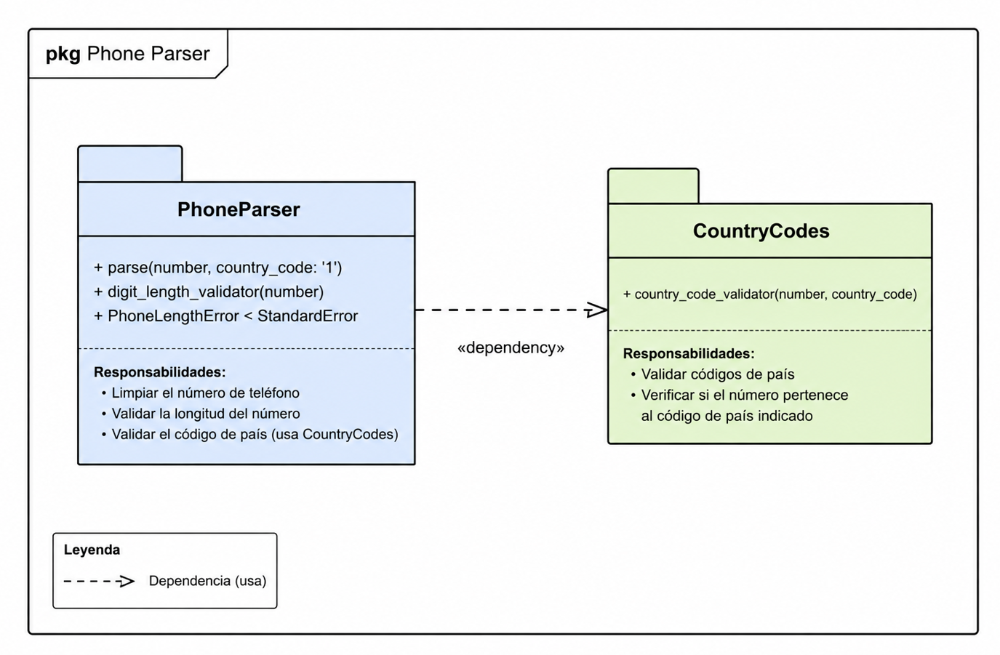

Analizar el proyecto “Phone Parser” y crear un Package Diagram UML que represente la organización de los módulos del sistema y las dependencias entre ellos.

El objetivo es:

- identificar los paquetes o módulos principales,
- representar cómo se comunican entre sí,
- visualizar las dependencias del sistema,
- comprender cómo se organiza una librería antes de programarla.

El proyecto contiene un módulo principal llamado PhoneParser y un módulo auxiliar llamado` CountryCodes`, encargado de validar códigos de país.

El diagrama muestra:

un paquete principal (PhoneParser),
un paquete auxiliar (CountryCodes),
una dependencia entre ambos módulos,
la estructura general de la librería.

Es un diseño de alto nivel pensado para entender la arquitectura general antes de entrar en detalles más específicos del código.