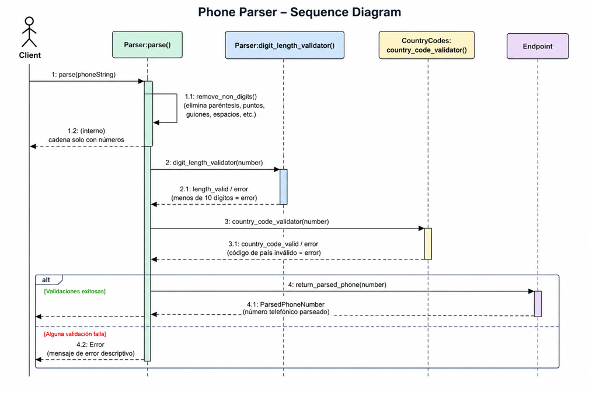

Desarrollar un Sequence Diagram en UML para el sistema Phone Parser.

El objetivo del diagrama es representar cómo el sistema procesa un número de teléfono ingresado por un usuario, mostrando la comunicación entre los distintos módulos encargados de limpiar, validar y devolver el número procesado.

El flujo debe comenzar cuando el cliente envía una cadena de texto al método Parser:parse(). Posteriormente, el sistema debe:

- eliminar símbolos no numéricos como paréntesis, puntos y guiones,
- validar la longitud del número,
- comprobar que el código de país sea válido,
- y finalmente devolver el número telefónico parseado o un mensaje de error en caso de validación incorrecta.

El diagrama debe incluir:

- participantes,
- mensajes enviados entre módulos,
- respuestas retornadas,
- llamadas internas del propio módulo,
- y el flujo completo desde la entrada hasta la salida del sistema.

---

Este Sequence Diagram representa el flujo de comunicación interno del sistema Phone Parser durante el procesamiento de un número telefónico.

El proceso inicia cuando el cliente envía una cadena de texto al método Parser:parse(). A continuación, el parser realiza una llamada a sí mismo para limpiar la entrada y eliminar todos los caracteres que no sean números.

Una vez normalizado el contenido, el sistema envía el número al módulo Parser:digit_length_validator() para verificar que la longitud sea válida. Si el número tiene menos de 10 dígitos, el sistema devuelve un error.

Después de validar la longitud, el flujo continúa hacia CountryCodes:country_code_validator(), encargado de comprobar si el código de país existe y es válido.

Cada comunicación entre módulos se representa mediante líneas sólidas para los mensajes enviados y líneas punteadas para las respuestas recibidas. Finalmente, si todas las validaciones son correctas, el sistema retorna el número telefónico parseado al cliente.

Este diagrama permite visualizar claramente el orden de ejecución de los procesos, las dependencias entre módulos y la interacción entre los distintos componentes del sistema.