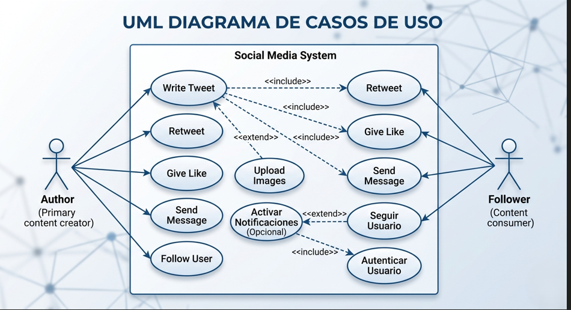

Use Case Diagram (Diagrama de Casos de Uso)

## Objetivo

Diseñar un Use Case Diagram para representar las principales funcionalidades de una aplicación similar a Twitter.

El diagrama debe mostrar:

- los actores del sistema,
- las acciones que pueden realizar,
- y las relaciones entre los diferentes casos de uso.

---

# Requisitos

El sistema debe incluir al menos dos actores principales:

- Author
- Follower

---

# Funcionalidades principales

El diagrama debe representar casos de uso relacionados con:

- escribir tweets,
- realizar retweets,
- dar likes,
- enviar mensajes,
- y seguir usuarios.

---

# Relaciones entre casos de uso

Debes utilizar correctamente relaciones UML como:

- `<<include>>`
- `<<extend>>`

Por ejemplo:

- escribir un tweet puede incluir:
  - retweet,
  - like,
  - mensajes.

También puedes añadir funcionalidades opcionales.

Ejemplo:

- subir imágenes a un tweet mediante una relación `<<extend>>`.

Actores:

- Author: usuario que crea y gestiona tweets.
- Follower: usuario que interactúa con contenido (seguir, like, retweet, mensaje).

Caso de uso principal:

Write a Tweet: acción central del sistema que agrupa la creación e interacción con contenido.

Relaciones <<include>>:

- Like Tweet
- Retweet Tweet
- Send Message
  (acciones relacionadas dentro del flujo de interacción del sistema)

Relación <<extend>>:

- Upload Image
  (funcionalidad opcional añadida a un tweet)

Nota:
Todos los usuarios pueden actuar como author y follower dentro del sistema.