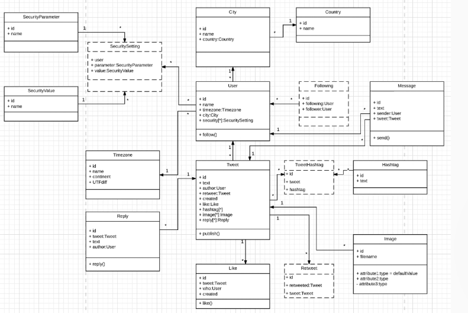

# Class Diagram (Diagrama de Clases)

Debes construir un Class Diagram que represente la estructura interna de la aplicación.

El objetivo es modelar:

- entidades,
- atributos,
- métodos,
- y relaciones entre clases.

Cada clase representará una entidad independiente del sistema y podrá interpretarse como una tabla de base de datos.

### Clases obligatorias

El sistema debe incluir al menos las siguientes clases:

- User
- Tweet
- Retweet
- Preference
- Security
- Message
- Hashtag
- Reply
- Like
- Location
- Image

También debes representar la relación:

- usuarios pueden seguir a otros usuarios.

---

### Qué debe incluir cada clase

Cada clase debe contener:

### Atributos

Por ejemplo:

- id
- username
- email
- content
- createdAt

Puedes definir los atributos libremente.

---

### Métodos / Operaciones

Por ejemplo:

- postTweet()
- deleteTweet()
- getTweets()
- followUser()

Los nombres y comportamiento de los métodos quedan a tu criterio.

---

###  Relaciones entre clases

Debes modelar correctamente las asociaciones y multiplicidades.

Ejemplos:

- un usuario puede tener muchos tweets,
- un tweet puede tener muchos likes,
- un tweet puede contener imágenes,
- un usuario puede seguir a muchos usuarios.

Ninguna clase debe quedar aislada.

Todas las entidades deben relacionarse entre sí de alguna manera.

---

- Relaciones
    Usuario como núcleo del sistema
    - Un User puede crear muchos Tweets
    - Un User puede dar muchos Likes
    - Un User puede enviar Messages
    - Un User puede seguir a otros Users (self-relationship)

    Esto convierte al usuario en el centro del sistema.

- Multiplicidad (muy importante)

    Define cuántos elementos se relacionan:

    - 1 User → * Tweets (un usuario tiene muchos tweets)
    - 1 Tweet → * Likes (un tweet tiene muchos likes)
    - 1 Tweet → * Replies (un tweet tiene muchas respuestas)

        Significa:

        - un usuario puede tener muchos tweets,
        - pero cada tweet pertenece a un único usuario.

    Esto es clave porque define cómo se traducirá a base de datos (foreign keys).

- (tablas intermedias)

    Se usan para resolver relaciones muchos-a-muchos:

    - TweetHashtag → conecta Tweets con Hashtags
    - Retweet → conecta tweets entre sí
    - Following → conecta Users con otros Users

    Estas tablas:

    no representan lógica compleja,
    solo conectan entidades,
    pueden tener datos adicionales (ej: timestamp).

- Self-referential relationships (auto-relaciones)

    Se usan cuando una entidad se relaciona consigo misma:

    - User → User (followers)
    - Tweet → Tweet (retweets)

    Esto permite funcionalidades como:

    - seguir usuarios,
    - construir feeds,
    - compartir contenido.
