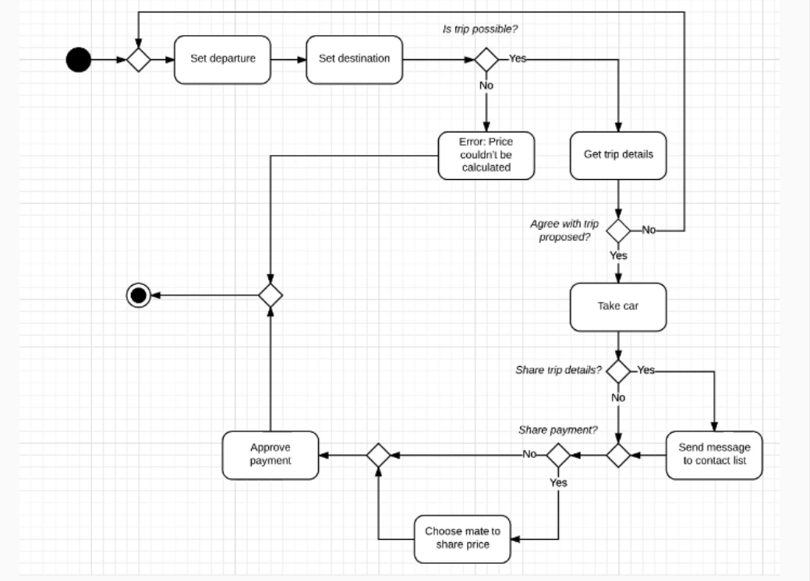

Diagrama de Actividad — Proceso de solicitud de viaje

Debes diseñar un diagrama de actividades que represente el proceso completo de solicitud de un servicio de transporte tipo Uber.

El flujo debe describir desde que el usuario inicia una solicitud de viaje hasta que el viaje finaliza o es cancelado.

El diagrama debe incluir entre 8 y 12 actividades.

Ejemplos de actividades:

- Establecer destino
- Solicitar un vehículo
- Compartir detalles del viaje

También debe incluir lógica de ramificación (decisiones del sistema), por ejemplo:

- ¿Es posible realizar el viaje?
- ¿Se comparte el pago con otros usuarios?

Las ramas permiten que el sistema tome decisiones y dirija el flujo a diferentes acciones según las condiciones. Por ejemplo, si el viaje es posible, continúa el proceso; si no lo es, se dirige a otro flujo alternativo.

El objetivo es representar el flujo completo del proceso de solicitud de un viaje, incluyendo decisiones y alternativas.

--- 

El diagrama de actividad UML representa el flujo de procesos del sistema de solicitud de un viaje en Uber. El modelo comienza con la definición de los puntos de inicio del usuario (ubicación de recogida) y el destino del viaje. A partir de estos datos, el sistema ejecuta una validación para determinar si el viaje puede realizarse.

Si la validación es negativa, el flujo termina con una notificación de error o rechazo. Si es positiva, el sistema genera la información del viaje y permite al usuario tomar una decisión de aceptación o rechazo. En caso de rechazo, el flujo regresa al inicio del proceso; en caso de aceptación, se continúa con la asignación del viaje y el inicio del servicio.

Durante la ejecución del viaje se incluyen decisiones opcionales como compartir la ubicación del trayecto y compartir el pago entre varios usuarios. Finalmente, el flujo concluye cuando el viaje ha sido confirmado, ejecutado y el pago ha sido procesado.

El diagrama enfatiza los puntos de decisión y las bifurcaciones del flujo, que determinan las diferentes rutas posibles dentro del sistema.