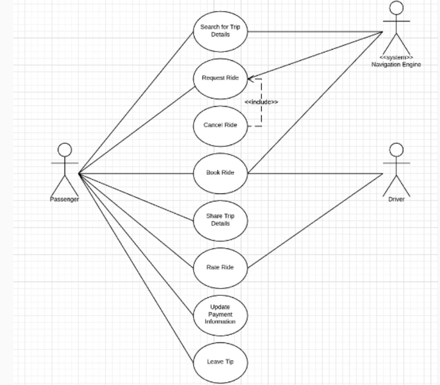

Diagrama de Casos de Uso — Interacción del sistema

Debes diseñar un diagrama de casos de uso que represente cómo interactúan los distintos actores con la aplicación móvil.

Actores:

- Pasajero (Passenger)
- Conductor (Driver)
- Sistema (System)

Casos de uso:

- Buscar detalles del viaje
- Solicitar un viaje
- Cancelar un viaje
- Reservar un viaje
- Compartir detalles del viaje
- Calificar el viaje
- Actualizar información de pago
- Dejar propina

El objetivo es representar qué acciones puede realizar cada actor dentro del sistema y cómo interactúan con la aplicación.

---

Este diagrama de casos de uso representa cómo interactúan los distintos actores con el sistema de Uber y qué funcionalidades tiene disponibles cada uno. El objetivo principal es mostrar los permisos y acciones que pueden realizar tanto los pasajeros como los conductores dentro de la aplicación.

El actor principal es el Passenger, ya que tiene acceso a la mayoría de las funciones del sistema, como buscar detalles del viaje, solicitar un viaje, reservarlo, cancelarlo, compartir información del trayecto y dejar propina o calificaciones. El Driver tiene un conjunto más limitado de funciones, principalmente aceptar viajes y calificar la experiencia del pasajero.

Además, el diagrama incluye al System o Navigation Engine, encargado de gestionar procesos automáticos como la navegación, cálculo de rutas, ubicación en tiempo real y actualización del recorrido durante el viaje. Este componente interactúa especialmente en acciones relacionadas con búsqueda, solicitud y seguimiento del trayecto.

El diagrama también muestra dependencias entre casos de uso. Por ejemplo, cancelar un viaje depende de que exista primero una solicitud activa de viaje. En conjunto, el modelo permite visualizar la organización funcional del sistema y cómo cada actor participa dentro de la plataforma.