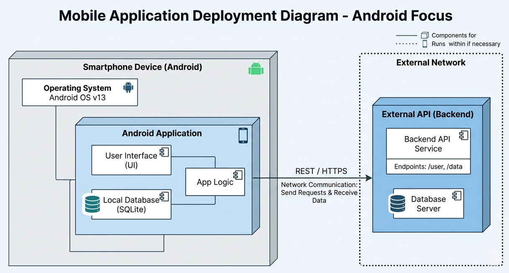

Diagrama de Despliegue — Aplicación móvil

Debes diseñar un diagrama de despliegue que represente cómo se implementa la aplicación móvil en un entorno real.

El enfoque debe estar únicamente en la parte móvil del sistema.

El diagrama debe incluir entre 3 y 4 nodos:

- Dispositivo smartphone
- Aplicación Android
- API (backend externo)

Se debe definir qué componentes se ejecutan en cada nodo y cómo se comunican entre ellos.

El objetivo es mostrar la arquitectura de despliegue de la aplicación móvil, incluyendo dependencias críticas entre la app, el dispositivo y los servicios externos.

--- 

Este diagrama de despliegue representa la arquitectura básica de la aplicación móvil de Uber para Android y muestra cómo se distribuyen e interactúan los componentes principales del sistema. El modelo se centra en la relación entre el dispositivo móvil, el entorno de ejecución Android y la API que permite la comunicación con los servicios externos.

El nodo principal es el dispositivo móvil, donde se ejecuta la aplicación Uber dentro del entorno Android. La aplicación depende directamente de una API para obtener y enviar información, como datos de usuarios, ubicaciones, rutas y solicitudes de viaje. Sin esta conexión, la aplicación no podría funcionar correctamente.

El diagrama también refleja la existencia de componentes compilados y datos dinámicos dentro de la aplicación. El código Java de Android requiere compilación, mientras que la información recibida desde la API, normalmente en formato JSON, se procesa dinámicamente durante la ejecución.

Además, se incluye una especificación de despliegue encargada de gestionar versiones, actualizaciones y configuraciones necesarias para publicar y mantener la aplicación. En conjunto, el diagrama permite visualizar cómo se organiza la infraestructura móvil y cómo interactúan sus elementos principales dentro del sistema Uber.