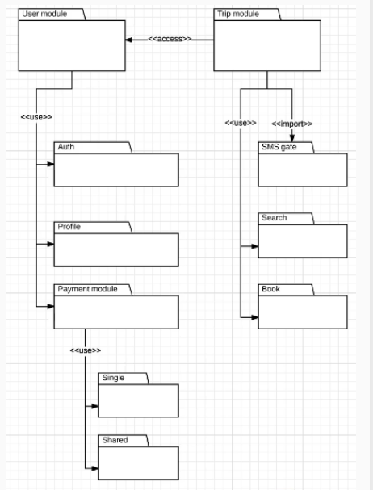

Diagrama de Paquetes — Estructura de la aplicación móvil

Debes diseñar un diagrama de paquetes que represente la estructura general de la aplicación móvil de Uber.

El sistema debe organizarse en módulos principales como:

- Usuario (User)
- Viaje (Trip)

Cada módulo debe incluir submódulos internos, por ejemplo:

- Autenticación dentro de User
- Reserva (Booking) dentro de Trip
- Pago (Payment)

Además, se deben incluir submódulos anidados relacionados con el sistema de pagos:

- Pago único (Single payment)
- Pago compartido (Shared payment)

El objetivo es representar la estructura de alto nivel de la aplicación y cómo se relacionan sus módulos, sin entrar en detalles de implementación.

---

Este diagrama de paquetes muestra la estructura modular básica de un sistema tipo Uber. El sistema se divide en módulos principales como User y Trip, los cuales interactúan entre sí mediante dependencias y accesos controlados. Cada paquete agrupa funcionalidades específicas, por ejemplo autenticación, perfil de usuario, pagos, búsqueda y reserva de viajes. El objetivo del diagrama es representar la organización general del sistema antes de la implementación en código, facilitando la planificación de componentes, relaciones y responsabilidades dentro de la aplicación.